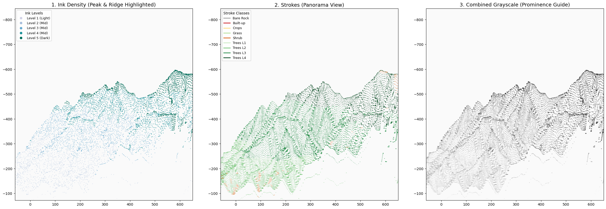

# Datascape: The Algorithm of "True View" (眞景山水) and Robotic Fabrication

> **"Defining digital geospatial data as the 21st-century's 'True View' (眞景) and realizing it through procedural ink logic and robotic fabrication."**

  
   
  <i>Fig 1. Datascape Simulation Pipeline: (1) Ink Density (Peak & Ridge), (2) Stroke Vectors (Panorama), (3) Combined Guide.</i>

## 1. Philosophy: Digital "True View" (眞景山水畵)
Traditionally, **Jinkyung-sansu-hwa** (眞景山水畵: True-view landscape painting) referred to artists capturing the landscape they physically experienced. Today, in an era where high-resolution satellites and LiDAR scan the Earth’s surface, quantified terrain data is not a mere imitation. This digital data itself is the most objective and "True View" (眞景) of nature in the 21st century.

**Datascape** discovers the fundamental similarity between the working methods of historical landscape masters and modern digital algorithms. Historical masters did not simply copy nature; they "decomposed" it into "rules" (Mapping towering peaks to ink density and categorizing rock formations into symbolic stroke types like *Bubyeokjun*). The process of traditional painting was already a sophisticated form of **algorithmic data processing** within the artist's mind.

---

## 2. Technical Implementation
This project translates the "algorithm of decomposition" from the human mind into machine language:
* **Algorithmic Mapping:** Elevation and vegetation data are transposed into ink density (Nongdam) and voids.
* **Feature Decomposition:** Land attributes are decomposed into over 10 traditional brushstroke classes and reassembled through code.
* **Robotic Fabrication:** The digital landscape escapes the screen through a custom **robotic plotter**. By precisely controlling brush pressure, this system proposes a new paradigm: the **Mass Production of "True Views,"** moving beyond the one-time nature of traditional art.

---

## 3. Project Pipeline
1. **Data Extraction (GEE):** Harvesting global DEM and multispectral imagery via Google Earth Engine.
2. **Topographic Analysis:** Calculating **TPI (Topographic Position Index)** for peak and ridge identification.
3. **Stroke Classification:** Procedural mapping of land cover (NDVI/Dynamic World) to traditional stroke logic.
4. **Kinetic Realization:** Generating robotic **G-code** for physical ink wash output on traditional paper.

---

## 4. Core Modules
* **`gee/data_extraction.js`**: JavaScript module for automated geospatial data harvesting.
* **`src/`**: Modularized Python engine for analysis and visualization.
  * `terrain_analyzer.py`: GIS feature extraction and prominence mapping.
  * `landscape_renderer.py`: Traditional perspective projection with horizon buffer.
  * `gcode_engine.py` (WIP): Robotic trajectory and pressure control interface.

---

## 5. Attribution & Copyright
* **Platform:** Processed via **Google Earth Engine (GEE)**.
* **Data Sources:** NASA SRTM 30m, Sentinel-2 L2A, Dynamic World V1.
* **Copyright:** Map data ©2026 Google / NASA / USGS. Algorithmic logic and robotic system design ©2026 Seong Geon Lee.
