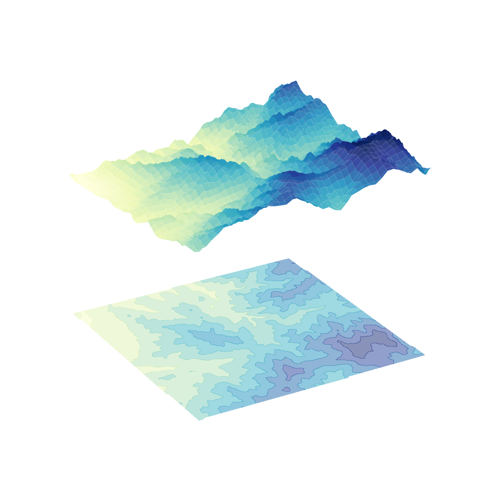

# Datascape: The Algorithm of "True View" (眞景山水) and Robotic Fabrication

  
  
  
  
  

> **"From 18th-century realism to 21st-century data: Redefining 'True View' (眞景) through procedural ink logic and robotic fabrication."**

  
   
  <b>Fig 1.</b> Datascape Simulation Pipeline: (1) Ink Density (Peak & Ridge), (2) Stroke Vectors (Panorama), (3) Combined Guide.

## 1. Philosophy: Evolution of "True View" (眞景山水畵)

### **The Comparison of Realism**
| 18th Century: Physical Realism | 21st Century: Digital Realism |
| :--- | :--- |
|  |  |
| *Geumgang jeondo (眞景山水畵) by Jeong Seon* | *Algorithmic Terrain Analysis (SRTM Data)* |

**Historical Shift of "Truth"**
* **The 18th Century:** Masters like Jeong Seon captured Mt. Kumgang through direct observation. "True View" (眞景) meant the landscape one could physically experience.
* **The 21st Century:** High-resolution satellite and LiDAR data provide a millimeter-scale scan of the Earth. This quantified data—objective and precise—is the most authentic **"True View" (眞景)** of our era.

**Algorithmic Archetype**
Datascape reveals that traditional masters—who "decomposed" nature into rules like *Nongdam* (ink density) and *Junbeop* (stroke types)—performed a process fundamentally identical to modern digital data processing.

---

## 2. Technical Implementation
This framework translates human artistic decomposition into machine logic:
* **Data-driven Aesthetics:** Elevation/vegetation data are transposed into ink density (Nongdam) and voids.
* **Feature Decomposition:** Land attributes are mapped to 10+ traditional brushstroke classes (e.g., *Bubyeokjun*) via procedural code.
* **Robotic Fabrication:** Realizing digital "True Views" through an **Arduino-based robotic plotter** that controls precise brush pressure on traditional paper.

---

## 3. Project Pipeline
1. **Data Extraction (GEE):** Global DEM harvesting via **Google Earth Engine (JavaScript)**.
2. **Topographic Analysis:** **Python-based** feature extraction (TPI/Slope) for peak/ridge identification.
3. **Stroke Classification:** Procedural mapping of land cover (NDVI/Dynamic World) to ink stroke logic.
4. **Kinetic Realization:** Translating vectors into **G-code** for robotic output via **Arduino**.

---

## 4. Attribution & Copyright
* **Historical Image:** *Geumgang jeondo* (Complete View of Mt. Kumgang) by Jeong Seon (1676–1759). Public Domain.
* **Satellite Data:** NASA SRTM 30m, Sentinel-2 L2A, Dynamic World V1 via **Google Earth Engine**.
* **Copyright:** Algorithmic logic and robotic system design ©2026 Seong Geon Lee.
